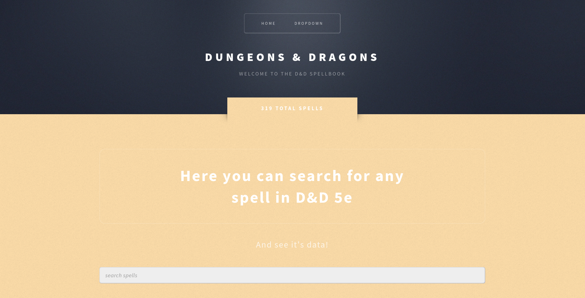
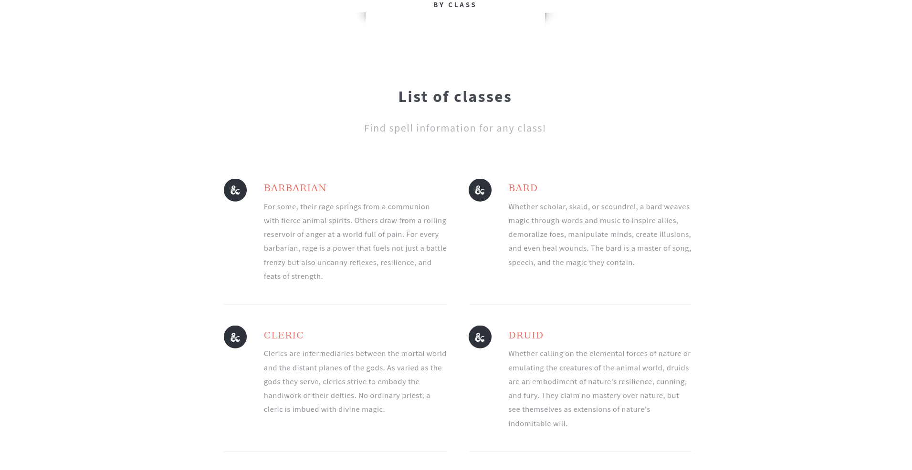

# Spellbook for Dungeons & Dragons

## Introduction

This website allows a user to search for any spell in Dungeons and Dragons 5th Edition or view a list of all spells 
currently available.



As of right now, they are also able to view any spell information within a specific class. For 
example if a user wanted more information about the druid class, they're presented with a description about the 
class and are able to click the class name to see every spell a druid can learn.



## Prerequisites

<ul>
    <li><a href="https://www.jetbrains.com/pycharm/">Pycharm</a>, <a href="https://code.visualstudio.com/">VSCode</a>
(add the Python extension) or any other IDE for writing code in Python</li>
    <li>This project uses the <a href="https://flask.palletsprojects.com/en/3.0.x/">Flask</a> framework and the 
        <a href="https://5e-bits.github.io/docs/">DnD 5e API</a>
    </li>
</ul>


## Installation

### Clone this Repository

```bash
git clone https://github.com/jstep21/dnd-spellbook.git
```

### Install Necessary Packages

###### Flask

```bash
pip install flask
```
